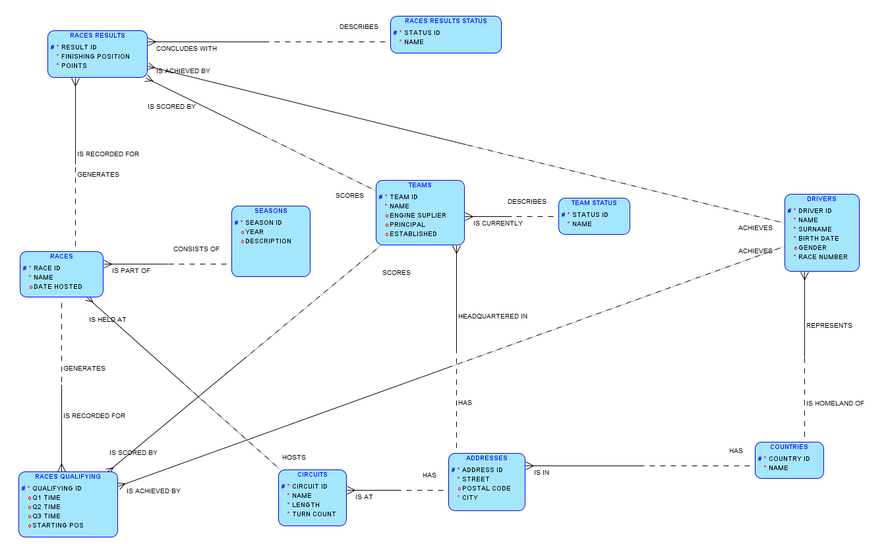
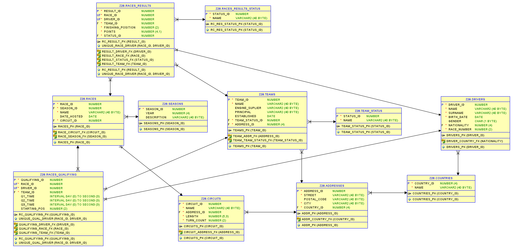

# System zarządzania danymi Formuły 1

Projekt tworzony przez:
* Szymon Frelik
* Maksim Lubentsov

## Opis projektu

### Temat

Projekt to relacyjna baza danych pozwalająca na zarządzanie sezonem wyścigowym mistrzostw Formuły 1. Projekt koncentruje się na aspekcie sportowym i statystycznym zawodów.

### Funkcjonalność

* Zarządzanie zespołami
* Zarządzanie kierowcami
* Zarządzanie kalendarzem wyścigów
* Rejestrowanie wyników sesji kwalifikacyjnych i wyścigowych
* Generowanie klasyfikacji generalnej dla poszczególnych sezonów
* Wysyłanie zapytań statystycznych

### Struktura bazy

1. Tabele słownikowe: `countries`, `addresses`, `team_status`, `races_results_status` - zapewniają wysoki stopień normalizacji danych, eliminując redundancję informacji
2. Tabele zarządzania zasobami: `teams`, `drivers`, `circuits`, `seasons` - przechowują informacje o encjach biorących udział w zawodach
3. Tabele wyników: `races`, `races_results`, `races_qualifying` - realizują relacje między kierowcami i zespołami a wydarzeniami, przechowując metryki sportowe

## Uruchamianie aplikacji Java

```
cd java
mvn clean compile
mvn exec:java -Dexec.mainClass="Main"
```

## Diagramy bazy danych

### Model ER


### Model relacyjny


## Analiza rozwiązania

### Zalety

* Wysoki poziom normalizacji
* Elastyczność historyczna poprzez przypisanie zespołu w `races_results` zamiast w `drivers` co pozwala na obsługę transferów kierowców w trakcie sezonu
* Zastosowanie wyzwalaczy do walidacji logiki zapewnia integralność danych

### Wady

* Brak obsługi formatu Sprint weekendu wyścigowego wprowadzonego w sezonie 2021
* Uproszczony system punktacji - Logika bazy danych przyjmuje aktualnie panujący system punktowy, podczas gdy on zmienia się na przestrzeni lat (ostatnie zmiany w latach 2003 i 2010). Możliwe poszerzenie bazy danych o tabelę `points_systems`, która byłaby powiązana z tabelą `seasons`, co pozwoliłoby na dynamiczne mapowanie systemów punktowych do poszczególnych sezonów.
* Zmiana nazwy zespołu nadpisuje się w wynikach historycznych - możliwe rozwiązanie problemu poprzez dodatkową tabelę `teams_name_history` przechowująca nazwy zespołów w danych latach
